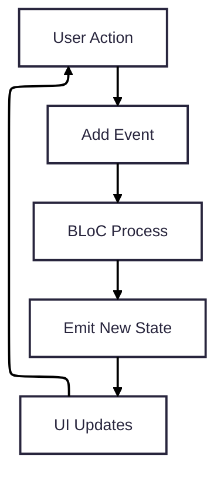

```mermaid
---
config:
  theme: redux
  layout: elk
---
flowchart TD
    User["User Action"] --> Event["Add Event"]
    Event --> BLoC["BLoC Process"]
    BLoC --> State["Emit New State"]
    State --> UI["UI Updates"]
    UI --> User
```
