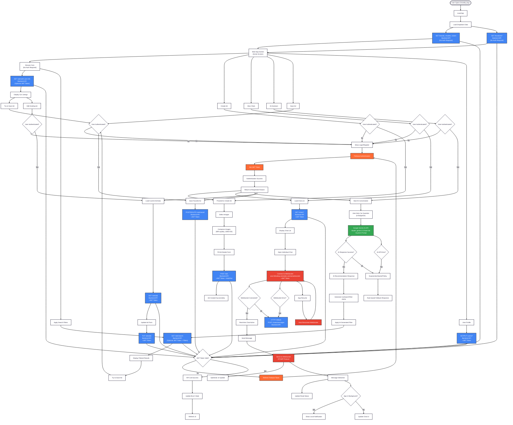

# DriveBuy Frontend Communication Flow

## Service Communication Summary

### 🔥 Firebase Services
- **Authentication**: Email/password login, JWT token management
- **Token Refresh**: Automatic token renewal for API calls

### 🔵 Backend API (Spring Boot)
- **Base URL**: `https://drivebuy.onrender.com`
- **Authentication**: Firebase JWT tokens in Authorization headers (required for protected features)
- **Public Endpoints**: `/ads/*` (browsing), `/brands`, `/models`, `/colors`, `/locations/*`
- **Protected Endpoints**: `/ads/*` (create/edit), `/users/*`, `/chats/*`, `/ads/saved`

### 🟢 Google Gemini AI
- **Model**: `gemini-2.5-flash-lite`
- **Purpose**: AI-powered car recommendations in Bulgarian
- **Output**: Structured CarSearchFilter JSON

### 🔴 WebSocket/STOMP
- **URL**: `wss://drivebuy.onrender.com/ws/websocket`
- **Purpose**: Real-time chat with automatic reconnection
- **Fallback**: HTTP API calls if WebSocket fails

### Key Features
- **Graceful Degradation**: Services continue working if some APIs fail
- **Optimistic Updates**: Immediate UI feedback before server confirmation
- **Automatic Reconnection**: WebSocket reconnects on app resume
- **Image Compression**: 80% quality, 1280x720 max resolution
- **Multi-language Support**: AI assistant works in Bulgarian
