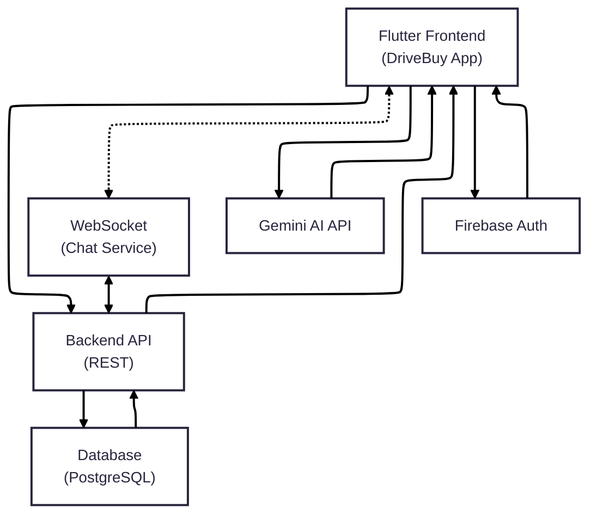

```mermaid
---
config:
  theme: redux
  layout: elk
---
flowchart TD
    Frontend["Flutter Frontend<br>(DriveBuy App)"] --> Backend["Backend API<br>(REST)"]
    Frontend <-.-> WebSocket["WebSocket<br>(Chat Service)"]
    Frontend --> Gemini["Gemini AI API"]
    Frontend --> Firebase["Firebase Auth"]
    
    Backend --> Database["Database<br>(PostgreSQL)"]
    WebSocket <--> Backend
    
    Backend --> Frontend
    Database --> Backend
    Gemini --> Frontend
    Firebase --> Frontend
```
