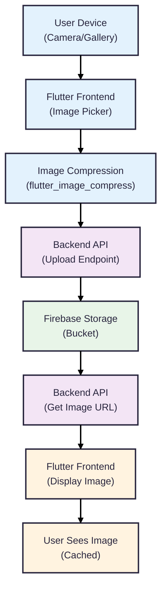

```mermaid
---
config:
  theme: redux
  layout: elk
---
flowchart TD
    %% Upload Flow
    Device["User Device<br>(Camera/Gallery)"] --> Frontend["Flutter Frontend<br>(Image Picker)"]
    Frontend --> Compress["Image Compression<br>(flutter_image_compress)"]
    Compress --> Backend["Backend API<br>(Upload Endpoint)"]
    Backend --> Storage["Firebase Storage<br>(Bucket)"]
    
    %% Retrieval Flow
    Storage --> BackendGet["Backend API<br>(Get Image URL)"]
    BackendGet --> FrontendGet["Flutter Frontend<br>(Display Image)"]
    FrontendGet --> UserSees["User Sees Image<br>(Cached)"]
    
    %% Styling
    classDef upload fill:#e3f2fd
    classDef process fill:#f3e5f5
    classDef storage fill:#e8f5e8
    classDef retrieve fill:#fff3e0
    
    class Device,Frontend,Compress upload
    class Backend,BackendGet process
    class Storage storage
    class FrontendGet,UserSees retrieve
```
